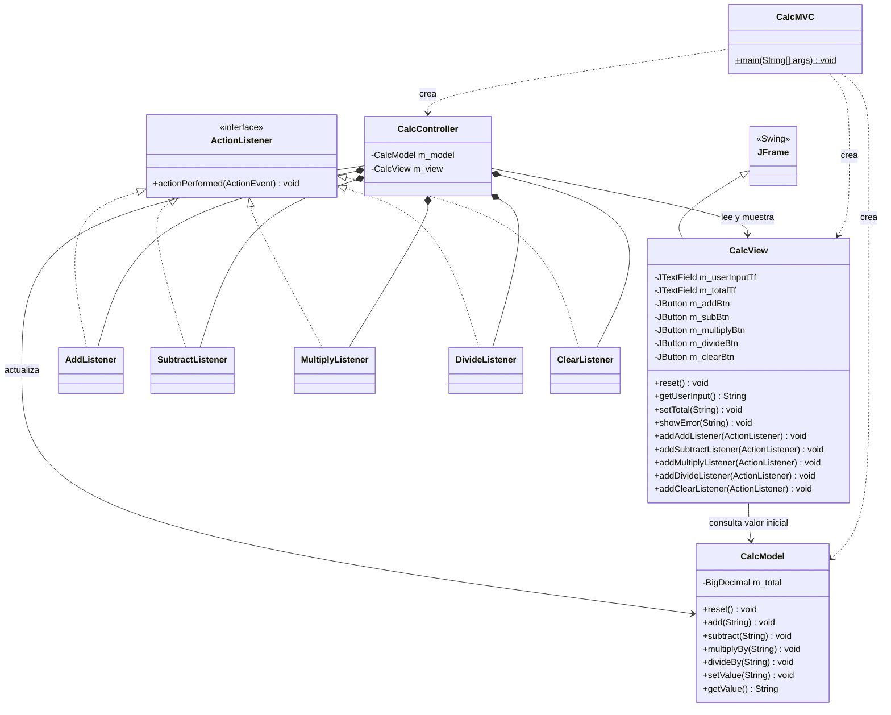

```mermaid
classDiagram
    class CalcMVC {
        +main(String[] args)$ void
    }
    class CalcModel {
        -BigDecimal m_total
        +reset() void
        +add(String) void
        +subtract(String) void
        +multiplyBy(String) void
        +divideBy(String) void
        +setValue(String) void
        +getValue() String
    }
    class CalcView {
        -JTextField m_userInputTf
        -JTextField m_totalTf
        -JButton m_addBtn
        -JButton m_subBtn
        -JButton m_multiplyBtn
        -JButton m_divideBtn
        -JButton m_clearBtn
        +reset() void
        +getUserInput() String
        +setTotal(String) void
        +showError(String) void
        +addAddListener(ActionListener) void
        +addSubtractListener(ActionListener) void
        +addMultiplyListener(ActionListener) void
        +addDivideListener(ActionListener) void
        +addClearListener(ActionListener) void
    }
    class CalcController {
        -CalcModel m_model
        -CalcView m_view
    }
    class AddListener
    class SubtractListener
    class MultiplyListener
    class DivideListener
    class ClearListener
    class JFrame {
        <<Swing>>
    }
    class ActionListener {
        <<interface>>
        +actionPerformed(ActionEvent) void
    }

    JFrame <|-- CalcView
    ActionListener <|.. AddListener
    ActionListener <|.. SubtractListener
    ActionListener <|.. MultiplyListener
    ActionListener <|.. DivideListener
    ActionListener <|.. ClearListener

    CalcController *-- AddListener
    CalcController *-- SubtractListener
    CalcController *-- MultiplyListener
    CalcController *-- DivideListener
    CalcController *-- ClearListener

    CalcController --> CalcModel : actualiza
    CalcController --> CalcView : lee y muestra
    CalcView --> CalcModel : consulta valor inicial
    CalcMVC ..> CalcModel : crea
    CalcMVC ..> CalcView : crea
    CalcMVC ..> CalcController : crea
```